# EasyBrailleEdit 使用手冊

更新日期：2016/11/13

## 簡介

本軟體的特色如下：

* 可將一篇編輯好的文件自動轉成點字，並進行雙視編輯。
* 支援中、英文點字、英文音標、以及小學程度的數學點字（包括分數）。
* 提供常用的符號表示法，包括：點譯者注、私名號、書名號、時間、座標等等。
* 可列印明眼字與點字的列印，方便製作雙視點字書，且支援單面／雙面列印與明眼字的預覽列印。列印出來的雙視書，明眼字和相對應的點字能夠對齊。
* 智慧型中文破音字判斷，例如：「不要」會自動轉換成「ㄅㄨˊ ㄧㄠˋ」的點字，而不是「ㄅㄨˋ ㄧㄠˋ」。一般文章正確率約可達九成以上。
* 可標示原書頁碼，以及自動計算與列印點字頁碼。

## 安裝

### 環境需求

硬體：

* 個人電腦：建議使用 Intel Core i5 或更高等級之 CPU ；記憶體至少  2GB，建議配備 4GB 以上的記憶體。
* 顯示器：至少 15 吋，建議使用 17 吋以上的顯示器。
* 點矩陣式印表機。只要支援 Windows 作業系統、列印寬度可達 132 行（可列印至少 13 英吋寬的紙張）的印表機均可。最好是可以列印三聯以上的複寫紙（這是因為點字紙比較厚，有些點矩陣印表機在捲動時會因為紙張太厚而卡紙，若印表機支援列印三聯以上的複寫紙，通常就不會有這個問題）。 參考廠牌型號：Epson LQ-2180（LQ-2180C）。
* 點字印表機。目前已實測過的點字印表機如下：
  * Enabling Technologis 公司的雙面點字印表機，型號為 ET、Juliet Classic/Juliet Pro、或 Trident。
  *	Impacto Texto

軟體：

* Windows 7、Windows 8（請注意：Windows XP 已不支援！）
* 微軟注音輸入法以及微軟新注音輸入法

### 安裝程序

執行安裝程式 setup.exe，按「下一步」直到安裝程式執行完畢。

易點雙視的預設安裝目錄為 C:\EasyBrailleEdit。

安裝完成後，您的 Windows 桌面上會有一個「易點雙視」捷徑。

## 環境設定

在使用「易點雙視」之前，您必須先確定您的電腦已經連接印表機（可能只連接明眼字印表機或點字印表機），並且建立好明眼字印表機的紙張設定（參考下個小節說明）。

### 明眼字印表機的紙張設定

請依下列步驟進行，以完成紙張設定（註：依作業系統的版本，實際操作時的介面可能會和此處的說明有些出入）。

1. 進入「控制台 > 印表機及傳真」。
2. 在「印表機及傳真」視窗中點擊主選單的「檔案 > 伺服器內容」。
3. 在「格式」頁籤中，勾選「建立新格式」的選項。往後的步驟亦可參考下圖。
4. 在「格式名稱」欄位中輸入「點字紙」。
5. 「單位」選擇「公制」，紙張寬度為 33.02cm，紙張高度為 27.94cm，上下左右的邊界均設為 0。
6. 最後按「儲存格式」鈕，即可完成設定。

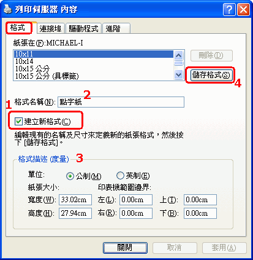

註：有些印表機即使不做上述設定，也能夠順利列印於點字紙，因為本軟體有自動指定紙張大小的功能。但有些印表機會根據紙張的設定來決定如何進紙，因此必須先建立紙張格式，才能順利列印。

**注意**

如果您要製作雙視文件──亦即同時在紙上印出點字和對應的明眼字，那麼點字就必須列印在明眼字的上方或下方，但由於明眼字和點字是分別由不同的印表機印出來，二者的位置很可能不會剛好對準。因此，將列印環境設定完成後，必須接著進行雙視文件的列印測試，並根據列印出來的結果調整明眼字的列印參數，或印表機的上下邊界、列距等設定。有關明眼字的列印參數，請參考下一節的「步驟4：列印」。

## 製作點字文件

點字文件或雙視書的製作流程如下圖所示：

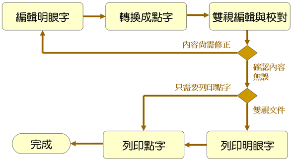

基本上，整個製作流程包含四大步驟：

1. 編輯明眼字
2. 將明眼字轉換成點字
3. 編輯點字（細部校正）
4. 列印點字

上述各個步驟中，步驟 1～2 為前置作業，步驟 3～4 則為後期製作。各步驟的詳細說明如下：

### 步驟 1：編輯明眼字

雖然可以用你習慣的純文字編輯器（例如：記事本，或者 Notepad++）編輯明眼字，然而製作點字書時，會需要用到一些特殊的符號或表示法，例如書名號、原書頁碼等等。此時，您可以使用「易點雙視」內建的編輯器來輸入這些特殊符號。參考下圖：

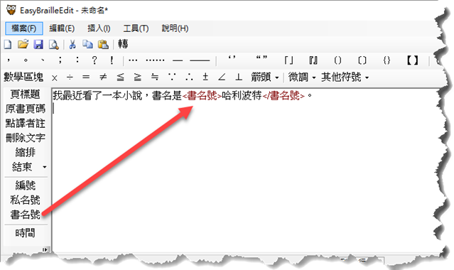

> **注意**
>
> 編輯明眼字時，切記不要自行斷行！否則到後面轉成點字時，反而要自行重新調整斷行。因為轉換點字時，系統會根據每列最大方數自動斷字，如果你已經事先斷行，就會造成很多不恰當且不必要的斷行。
> 另外，不建議使用 Word 來編輯明眼自，因為這裡並不需要特殊的字型與編排格式。使用 Word 反而可能增加後續處理的困擾。

由於「易點雙視」的純文字編輯器功能沒有一般的專業編輯器強大（例如：文字搜尋、置換、復原編輯、巨集錄製與播放等），因此你可能會需要在兩個編輯器之間切換，並且經常執行複製、貼上的動作。這樣的交替動作雖然看似麻煩，但其實只要練習幾次，就會知道如何充分利用兩種編輯器，以加速完成明眼字的編輯工作。比如說，先用你熟悉的文字編輯器把主要的內容都輸入完畢，再複製到「易點雙視」中修改。

> **技巧**
> 
> 編輯明眼字時，可以先自行編排需要縮排的部份。例如：縮排一方時，就在開頭輸入一個空格（敲一下空白鍵）。如果有一大段要縮排，可以用 <縮排> 標籤。

注意事項：

* 打勾符號是 "√"。
* 是非題的打圈及打叉符號分別是 "○" 及 "╳"（注意不是 "×"）。

### 步驟 2：轉換成點字

明眼字編輯完成後，只要按工具列的「轉」按鈕或者按 F5 鍵即可進行轉點字的程序（也可以點主選單的「工具 > 轉換成點字」）。參考下圖：

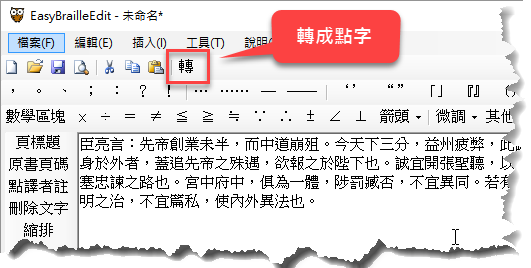

接著，會開啟轉點字的對話窗：

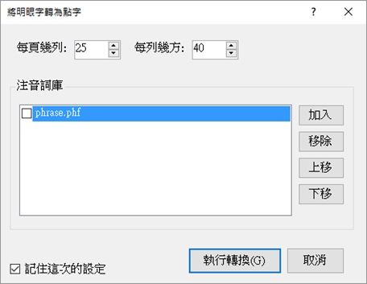

轉點字的對話窗裡面，您可以設定「每頁幾列」和「每列幾方」。這兩個參數將會影響轉出來的點字要在哪些地方斷行和跳頁。

**自訂詞庫**

轉點字時的對話窗裡面有個「注音詞庫」選項，它能夠讓你使用自訂的詞庫來修正某些詞彙的讀音。例如本軟體安裝時便提供了一個 phrase.phf 檔案，裡面的內如容下：

    氣得 ㄑㄧˋ ㄉㄜ˙
    東西 ㄉㄨㄥ ㄒㄧ˙
    什麼 ㄕㄣˊ ㄇㄜ˙
    意思 ㄧˋ ㄙ˙
    星星 ㄒㄧㄥ ㄒㄧㄥ˙

您可以用文字編輯器修改這個檔案，增加新詞與讀音。如此一來，每當轉點字時，便會優先使用您自訂的詞庫（注意在轉點字的對話窗中，必須勾選您想要使用的詞庫）。

**無法轉換的字元**

如果轉換過程有碰到無法轉換的字元，就會出現提示訊息，告訴你有幾個字元無法轉換，然後顯示一個視窗，在其中列出所有無法轉換的字元，如下圖所示：

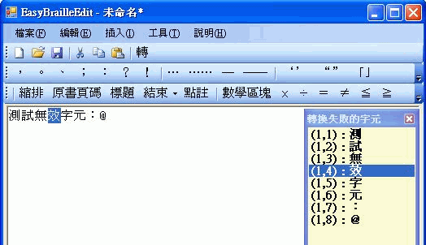

圖中右邊的視窗就是所有轉換失敗的字元，其中 (x, y) 表示第幾列的第幾個字元。您無須計算字元的位置，只要在那個字上面點一下滑鼠左鍵，編輯視窗的游標就會自動定位到那個字元，並將該字元選取，方便你辨識（如圖中的「效」），這樣您就可以針對每個轉換失敗的字元逐一修正。全部修正完畢之後，再按 F5 執行轉點字的功能。

### 步驟 3：編輯點字

點字轉換工作完成後，會自動開啟雙視編輯器。在此視窗中，您可以再細部修訂明眼字、中文字的注音符號、以及點字，也可以插入新的點字、空方，以及進行一些簡單的排版動作，例如：折行、縮排等。參考下圖：

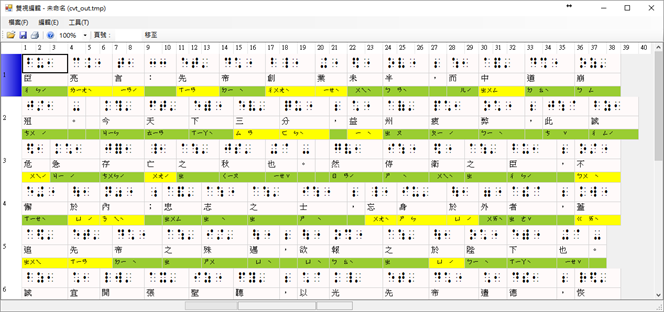

在轉換中文點字時，本系統具備智慧型詞庫辨識功能，能夠正確轉換大多數的常用詞彙，例如：「不要」會轉成「ㄅㄨˊㄧㄠˋ」的點字，而不會轉成「ㄅㄨˋㄧㄠ」。然而，有些詞彙難免因為一字多音的緣故，在轉點字時使用了不正確的讀音。此時您可以在雙視編輯器中修改注音符號（或者將經常出錯的詞彙加入自訂詞庫，參見稍早的「自訂詞庫」一節的說明）。
如果某個中文字是破音字，其注音符號在顯示時就會以黃色背景顯示，而比較常判斷錯誤的破音字，其注音符號就會以紅色背景顯示。至於非破音字，其背景色會是綠色，如下圖所示。

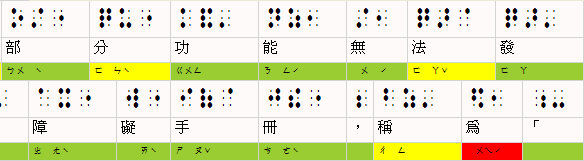

以下分別說明注音符號背景色代表的意義：

* 綠色：非破音字。
* 黃色：破音字。你可以在中文字或點字方格上點滑鼠右鍵以挑選別的注音符號（甚至修改明眼字和點字）。
* 紅色：比較常判斷錯誤的破音字，提醒你這裡要特別注意。

> **技巧：只轉換部份文字**
>
> 在編輯明眼字時，你如果想先知道某一些文字轉成點字會是什麼樣子，可以用鍵盤（Shift 加方向鍵）或滑鼠（左鍵拖曳）將這些文字選取起來，然後執行點字轉換功能，如此便可迅速得知轉換結果。你還可以利用此技巧得知一列文字在轉成點字時，將會在哪一個地方斷字（折行），以便進行更細緻的前置作業。由於後續的點字校正編輯工作比較耗費資源，電腦處理的速度較慢，因此如果能在編輯明眼字的前置作業就盡量完成排版工作，自然能縮短點字書的製作時間。

**細部校正點字**

在雙視編輯器的儲存格上點右鍵，會出現快顯功能表，其中包含幾項基本的編輯功能，如：修改、新增、刪除、新增一列、刪除一列等。參考下圖：

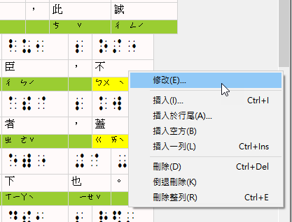

> **技巧**
> 
> 由於點字編輯器比較耗費資源，且需要執行較多運算，您會發現在編輯點字時，操作的反應不像編輯明眼字時那麼流暢。因此，在校正點字時，應該先注意段落編排的部份是否大致完成，以及明眼字是否有漏字、錯別字等，若發現這些錯誤，建議放棄這次的點字轉換結果，回到明眼字編輯器中進行修正，等明眼字都修正好了，再執行點字轉換。千萬不要急著修改破音字的注音，以及手動增加額外的點字和空方（縮排），這樣反而會增加製作點字書的時間；那些修正的動作應該是 等到明眼字、必要的空方、和基本的縮排都完成之後才進行。
> 記住此原則：優先使用明眼字編輯器修正，最後才使用點字編輯器進行細微調整。

### 步驟 4：列印

本節說明如何列印雙面的雙視文件，也就是列印明眼字和點字。

在雙視編輯器視窗中點選「檔案 > 列印」，或直接點工具列上的印表機圖示，即可開啟列印對話窗。製作雙視文件的基本步驟是先列印明眼字，然後再印點字。

#### 列印明眼字

列印明眼字時，請先確定「列印」對話窗裡的頁籤是切到「明眼字」。如下圖所示：

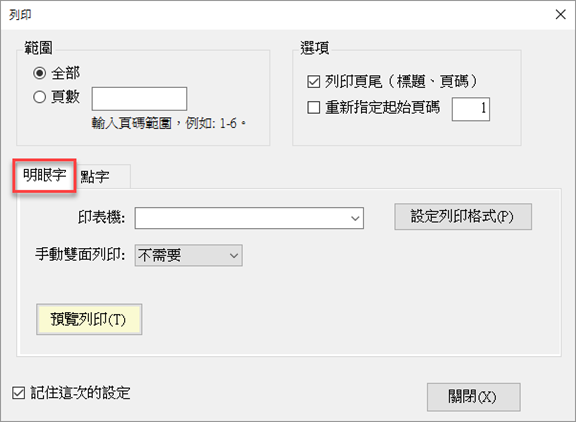

您必須先選擇印表機，然後點「設定列印格式」按鈕，以設定紙張、列印邊界、以及字型大小，參考下圖。

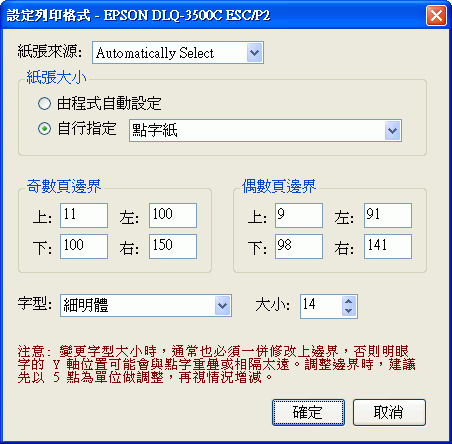

此設定列印格式的動作通常只需做一次（因為如果你在前一個視窗有將左下角的「記住這次的設定」，系統就會連同列印格式的設定一併儲存）。
要特別注意的是，奇數頁邊界與偶數頁邊界的設定，主要會跟兩個因素有關：

1. 點字印表機的邊界設定。
2. 明眼字的字型大小設定。

如果你修改了明眼字的字形大小，通常也必須一併調整列印的上邊界，否則列印出來的明眼字可能會與點字重疊或相隔太遠。你必須依你的環境實際測試之後，反覆調整頁邊界至最適當的範圍，這裡的圖例所顯示的，是測試時的設定 ，當時是將偶數頁的上邊界設定成比奇數頁少 2 點，左邊界則比奇數頁少 9 點。圖例中的設定可能不適用於你的環境。

設定列印格式的動作完成後，按「確定」鈕回到上一個視窗，在「雙面列印」下拉清單中選擇「只印奇數頁」，再按「預覽列印」按鈕，即可開啟明眼字的預覽列印視窗。 如果預覽時覺得資料已經不需要再修正，就可以直接點擊預覽視窗的列印鈕，將明眼字內容印出。

奇數頁印完後，接著列印偶數頁。請先將印好的奇數頁文件從印表機中取出，翻面之後重新裝上印表機（假設您的印表機沒有自動雙面列印的功能）。

> **注意**
> 
> 若採用手動雙面列印的方式，當您印完奇數頁之後，建議您多撕一張報表紙。舉例來說，如果奇數頁一共印了五張報表紙，那麼您就要撕六張報表紙，然後才繼續印偶數頁。如果沒有多撕一張紙，稍後在打印點字時，點字印表機在最後一頁可能會因為沒有足夠的紙張可供捲動送紙，而造成最後一頁的點字無法印出。

接著在「列印」視窗中，「雙面列印」下拉清單中選擇「只印偶數頁」，再按「預覽列印」按鈕，即可將偶數頁的明眼字印出。

#### 列印點字

雙面的明眼字印完後，接著將紙張抽出印表機，並裝上點字機（裝紙時，第一頁朝上），然後切到「點字」頁籤，按「列印點字」。參考下圖。

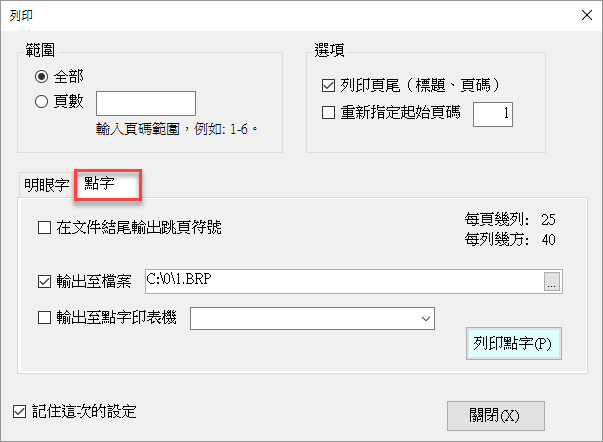

其中的「在文件結尾輸出跳頁符號」通常不需要勾選。如果您發現每次列印點字時，只有最後一頁印不出來，便可以嘗試將此選項打勾。

圖中的「輸出至點字印表機」和「輸出至檔案」選項，若二者皆勾選，則會將您資料分別列印至點字印表機和您指定的檔案。如果您的作業流程是先把所有點字文件都製作完畢再一次印出，可以只勾選「輸出至檔案」，等到所有檔案都輸出完畢，再將這些檔案利用「命令提示字元」視窗，透過 PRINT 或 TYPE 指令直接把整個檔案輸出至點字印表機。一般來說，您也可以利用 Windows 記事本來列印點字檔。

以下是列印指令的範例，此範例會將點字檔案 MyData.BRP 輸出至點字印表機（假設點字印表機的連接埠是 LPT1）：

~~~~~~~~
C:\>TYPE MyData.BRP > LPT1
~~~~~~~~

> **提醒**
> 
> 點字列印完畢之後，通常會將它裝訂起來，由於點字的凸點很容易因為不小心壓到而破壞，因此通常會在裝訂點字書時，於第一頁和最後一頁加訂保護頁。所謂的保護頁，只是在點字紙的其中一面印滿點字，且有印點字的那一面朝內，用來保護點字書的內容避免因為不小心壓到而破壞。你可以利用點字印表機的測試列印功能來列印保護頁。

## 其他使用技巧

### 多人分工合作
 
若文件內容很大，您可能需要讓多人分工合作。比如說，使用五台電腦同時進行點字編輯的工作，然後用一台電腦專門用來列印點字，這台電腦的運算能力不用太高，因為只是用來列印點字而已。如此一來，每當點字檔案製作完成，就可以將檔案集中交給單一機器進行列印工作。

### 破音字醒目提示

當您將明眼字轉換成點字，並進入雙視編輯視窗之後，可以看到破音字的注音會以黃色的背景色顯示，而以紅色顯示者則是容易誤判的破音字，例如：「為」、「和」等等。如果您發現有些破音字經常判斷錯誤，但是並未以紅色顯示，您也可以在應用程式的設定檔中加入該字，這樣下次碰到這個字時，EasyBrailleEdit 就會以紅色顯示，以便提醒您這是個經常誤判的破音字，需特別檢查。

**作法：**

用 Windows 附屬應用程式中的「記事本」開啟「易點雙視」安裝目錄的 Settings.xml 檔案，找到 "<ErrorProneWords>" 這個標籤，你會看到類似以下的內容：

~~~~~~~~
<ErrorProneWords>為和</ErrorProneWords>
~~~~~~~~

這段設定代表「為」跟「和」這兩個中文字在雙視編輯時，其注音都會以醒目的紅色顯示。您只要將您想要特別提醒的破音字加進去就行了，例如：您想要加入「們」這個字，結果會像這樣：

~~~~~~~~
<ErrorProneWords>為和們</ErrorProneWords>
~~~~~~~~

## FAQ

Q: 我應該在什麼地方插入原始頁碼的標籤？

A: 原始頁碼標籤（
）是用來標示「接下來」的明眼字是對應到原始書籍的第幾頁。因此，每當您在輸入明眼字時，碰到原書換了新頁，就可以插入原書頁碼。

Q: 為什麼列印點字時，點字印表機完全沒有反應（沒有輸出任何資料）？
A: 請依序檢查：

1. 在列印對話窗中，「輸出至點字印表機」選項是否有勾選？若未勾選，請勾選後再嘗試列印看看。
2. 檢查點字印表機電源是否開啟，或者重新開啟點字印表機的電源，再嘗試列印看看。
3. 檢查點字印表機與電腦的連接線是否鬆脫。
